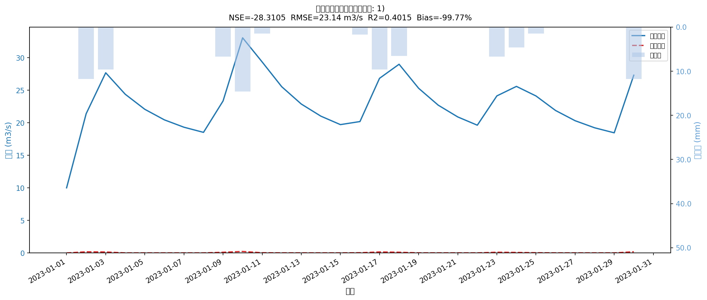

# 水文建模完整流程报告

> 生成时间：2026-04-11 15:32:52

---

## 1. 流域概况

| 项目 | 值 |
|---|---|
| 子流域数 | 347 |
| 总面积 | 492.9 km2 |
| 参数分区 | zone_headwater（89 个）、zone_confluence_2（80 个）、zone_confluence_3（71 个）、zone_outlet（67 个）、zone_confluence_1（40 个） |
| Shapefile | /Users/rainfields/hydrosis-local/research/Hydrology/examples/results/subbasins_with_zones.shp |
| 模拟时段 | 2023-01-01 ~ 2023-01-30 |
| 时间步长 | 日步长（86400 秒）|

---

## 2. 面雨量统计

- 计算方法：IDW（失败时降级为站点平均）
- 面雨量列：zone_headwater, zone_confluence_1, zone_confluence_3, zone_confluence_2, zone_outlet
- 累计降雨均值：**86.7 mm**
- 单时步最大：**14.6 mm**

### 面雨量统计（前3列）

| 统计量 | zone_headwater | zone_confluence_1 | zone_confluence_3 |
|---|---|---|---|
| mean | 2.89 | 2.89 | 2.89 |
| std | 4.50 | 4.50 | 4.50 |
| min | 0.00 | 0.00 | 0.00 |
| max | 14.63 | 14.63 | 14.63 |

---

## 3. 模拟性能指标

| 指标 | 值 | 说明 |
|---|---|---|
| NSE | **-28.3105** | Nash-Sutcliffe，1 为完美 |
| RMSE | **23.14 m3/s** | 均方根误差 |
| R2 | **0.4015** | Pearson r 的平方 |
| Bias | **-99.77%** | 系统偏差 |
| n | 30 | 公共时步数 |

---

## 4. 对比图

_蓝色实线=实测，红色虚线=模拟，蓝柱=面雨量（倒置）_

---

## 5. 结论

- 简化线性水库模型，参数分区：zone_headwater（89 个）、zone_confluence_2（80 个）、zone_confluence_3（71 个）、zone_outlet（67 个）、zone_confluence_1（40 个）。
- IDW 面雨量插值，共 5 个面雨量区。
- 参数未率定，建议用 calibrate_with_enkf.py 优化。

---

_由 run_full_pipeline.py 自动生成。_